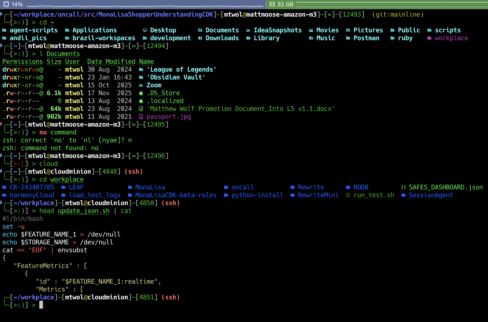

# Personal Development Environment

My personal shell configurations, custom scripts, and development environment setup for macOS.



## Quick Start

### New Machine Setup

Run the automated setup script to configure a fresh macOS installation:

```bash
curl -fsSL https://raw.githubusercontent.com/MatthewWolff/personal/main/new_computer.sh | bash
```

This installs:
- Homebrew and essential CLI tools (awscli, git-delta, ripgrep, fzf, bat, eza)
- Development environments (Docker, IntelliJ, PyCharm, VS Code, Sublime Text)
- Productivity apps (iTerm2, Raycast, Spectacle, Notion, Obsidian)
- Data science stack (R, RStudio, Anaconda, tidyverse)
- Node.js via nvm
- Custom shell configuration (zsh with oh-my-zsh)

### Shell Configuration

**Zsh (Primary)**
```bash
curl -fsSL zsh.wolff.sh | bash
```

## Features

### Custom Zsh Theme

The `wolffy` theme provides:
- Git branch and status indicators
- Battery level display
- AWS profile indicator
- Command execution time
- Custom prompt with error status
- Syntax highlighting and autosuggestions

### Utility Scripts

Located in `scripts/` and automatically added to `$PATH`. Includes tools for DNA/RNA translation, MOSS plagiarism detection, git exploration, backup automation, SSH tunnel management, and more.

### Shell Configuration

**Zsh** (`.zshrc`)
- Extended history (999,999,999 entries)
- Duplicate command filtering
- Auto-correction
- Completion waiting dots
- Plugins: git, battery, aws, zsh-autosuggestions, colored-man-pages

**Bash** (`.bashrc`)
- Legacy configuration available for systems where only bash is available
- Custom prompt with git branch detection and exit code visualization

### iTerm2 Profile

Custom iTerm2 color scheme and window settings in `iterm/Wolffy Window.json`.

Import via: iTerm2 → Preferences → Profiles → Other Actions → Import JSON Profiles

## Directory Structure

```
.
├── bash/               # Bash configuration (legacy/fallback)
│   ├── .bashrc
│   ├── .colors.sh
│   └── install_bashrc.sh
├── zsh/                # Zsh configuration (primary)
│   ├── .zshrc
│   ├── wolffy.zsh-theme
│   └── sudo_install_zsh.sh
├── scripts/            # Utility scripts (added to PATH)
├── iterm/              # iTerm2 profiles
├── new_computer.sh     # Automated macOS setup
└── ide_settings.zip    # JetBrains IDE settings
```

## Customization

### Modifying the Theme

Edit `zsh/wolffy.zsh-theme` and reload:
```bash
source ~/.zshrc
```

### Adding Scripts

Place executable scripts in `scripts/` directory. They'll be available system-wide after adding `~/scripts` to `$PATH`.

## SSH Key Generation

The setup script generates an ED25519 SSH key. Add the public key to GitHub:

```bash
cat ~/.ssh/id_ed25519.pub
```

→ https://github.com/settings/keys

## Requirements

- macOS (tested on recent versions)
- Xcode Command Line Tools
- Homebrew
- oh-my-zsh

## License

Personal use. Feel free to fork and adapt for your own setup.

## Author

Matthew Wolff
- Website: https://wolff.sh
- GitHub: [@MatthewWolff](https://github.com/MatthewWolff)
